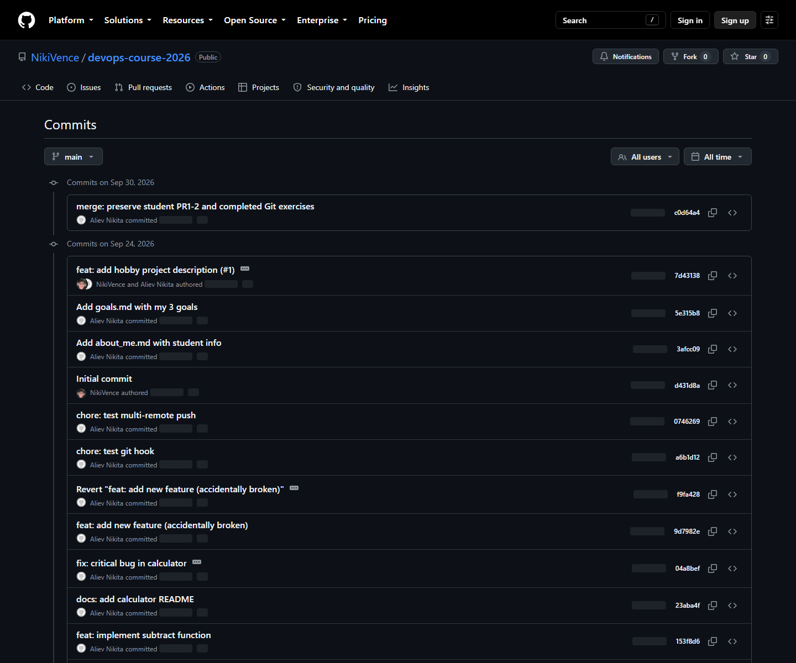
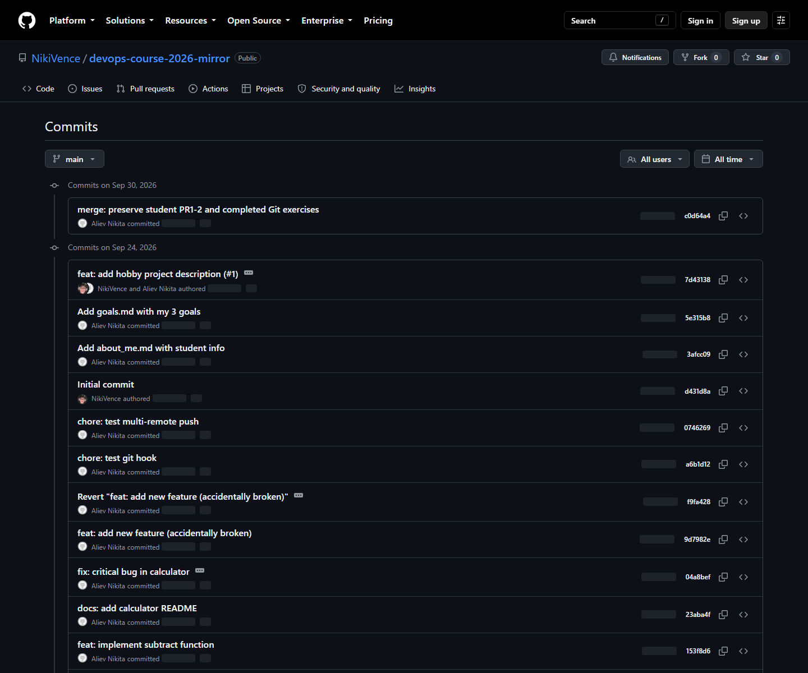

# Практическая работа №3

**Тема:** Продвинутые техники Git. Rebase, Squash, конфликты и Multi-Remote

**Дисциплина:** Инструменты DevOps

**Выполнил:** Алиев Никита Денисович, ЭФБО-01-24

**Преподаватель:** Гиматдинов Дамир Маратович

**ИПТИП · Кафедра индустриального программирования · 2026/2027**

## 1. Цель и исходное состояние

Освоить конфликты, merge и rebase, очистку истории, multi-remote,
cherry-pick, reflog, revert и Git hooks. Использован devops-course-2026.
Сохранённые журналы упражнений от 24.09.2026 проверены по объектам Git;
отчёт подготовлен 30.09.2026.

## 2. Разрешение конфликта README

В двух ветках изменено содержимое README. Git сообщил CONFLICT.
Финальный документ объединил сведения о студенте, описание и стек;
маркеры удалены. Итог сохранён тегом evidence/pr3-readme-resolved.

## 3. Merge и rebase

Операции выполнены в изолированных учебных ветках. После merge сохранён
коммит с двумя родителями; после rebase история линейная. Содержимое
деревьев одинаково. В методичке обычный merge мог бы стать fast-forward;
для наглядности использованы разошедшиеся ветки и merge --no-ff.

## 4. Interactive rebase: шесть коммитов в три

Для калькулятора созданы шесть коммитов. Через reword исправлены названия,
fixup объединил WIP и исправление с соответствующими изменениями,
drop убрал коммит oops. Итог — три содержательных коммита.

## 5. Cherry-pick, reflog и revert

Из hotfix-ветки перенесён только IMPORTANT_FIX: экспериментальные multiply
и divide в main не попали. После удаления учебной ветки потерянный коммит
найден в reflog и восстановлен. Вредная строка BROKEN_CODE отменена новым
revert-коммитом без переписывания опубликованной истории.

## 6. Хук и подготовка к контрольной

Хук commit-msg проверяет Conventional Commits: плохое сообщение
отклонено, `chore: test git hook` принято. Это именно commit-msg:
pre-commit выполняется до окончательного ввода сообщения.

В prep/kr-practice три черновых коммита объединены в один; подготовлены
ответы о merge/rebase, общей истории и multi-remote. Выполнен ещё один
конфликт для закрепления. Его журнал: pr3/13_homework_conflict.txt.

## 7. Multi-remote и итоговый статус

Основной адрес: https://github.com/NikiVence/devops-course-2026.
Адрес зеркала: https://github.com/NikiVence/devops-course-2026-mirror.
Для отправки в два места origin должен иметь два явных push-URL:
основной и зеркальный. Простое добавление только одного push-URL
не гарантирует сохранение исходного адреса отправки.

Выполнена отправка main и рабочих веток ПР3 в оба репозитория,
сохранены теги упражнений. Подготовительная ветка prep/kr-practice опубликована.
Ветка practice/rebase-playground и резервная ветка этой отправкой не затрагивались.
Проверка refs/heads/main подтвердила одинаковый хеш на двух серверах.
Коммит chore: test multi-remote push присутствует в обеих историях.

## 8. Вывод

Практически выполнены преобразования истории, конфликты, выборочный перенос,
восстановление и отмена изменений. Реальные коммиты и журналы сохранены.
Публичная история не сбрасывалась; различия двух локальных и удалённых
оснований согласованы обычным merge с сохранением обеих линий.
